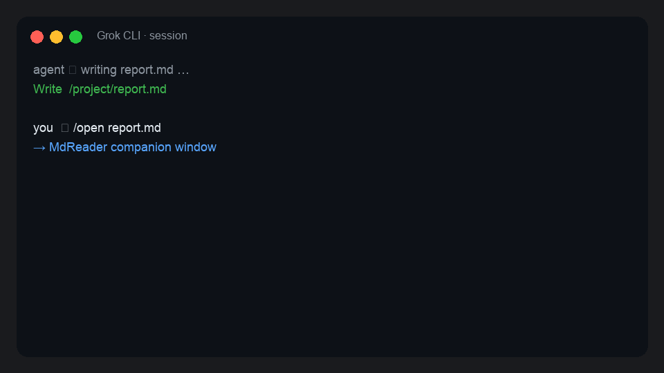

# grok-md-reader

Grok CLI 的 macOS Markdown 伴生阅读器。**装一次，之后在工具行路径上 Cmd+点击即可打开**（`.md` → MdReader，PDF → 预览，等等）。

[English README](README.md)



---

## 为什么做

编码 Agent 整天产出 markdown，终端里只有 raw 文本。想要接近 Claude Desktop 的「点一下就读」，又不要强迫每个 Agent 背 skill 纪律。

## 你得到什么

- **即装即点** — `./install.sh` 构建 **MdReader.app**、链接 Grok 插件，并按同一配置表 **写入 macOS 默认打开方式**（`.md` → MdReader，`.pdf` → Preview，已装则 Office）。Grok 工具行自带 `file://` 链接；Cmd+点击 = 系统 `open` → 这些默认。**不要求 Agent 配合。**
- **MdReader.app** — 原生小窗（Swift + WKWebView），离线 marked / highlight.js。
- **兜底 `/open` / `/preview`** — 路径只是聊天纯文本（不是超链接），或终端不支持 OSC-8 时用。
- **可选追踪** — hook 记录本会话写入文件；窗内 History + 热刷新。

## 安装

需要：macOS、Grok CLI、Python 3、Xcode Command Line Tools（`swiftc`）。

```bash
git clone https://github.com/yan-auto/grok-md-reader.git
cd grok-md-reader
./install.sh
```

脚本会：

1. 构建并安装 `~/Applications/MdReader.app`
2. 链接 `~/.grok/plugins/md-reader`
3. 安装侧信道追踪 hook
4. **写入系统默认打开方式**（跳过：`./install.sh --no-set-defaults`）
5. 跑 **doctor**

```bash
./install.sh --doctor          # 随时自检
./install.sh --set-defaults    # 只重写默认 App
./install.sh --no-set-defaults # 安装但不改默认 App
```

## 怎么打开文件

| 情况 | 做法 |
|------|------|
| 路径在 **工具行**（Write / Read / Edit） | **Cmd+点击** 路径 |
| 路径只是 **聊天纯文本** | `/open /完整路径` 或让 agent 打开 |
| 终端无 OSC-8（部分 Terminal.app） | `/open` / `/preview` |

**范围外：** 聊天气泡里的裸路径通常 **不是** 超链接——这是 Grok TUI 限制，不是没装好。

## 自定义映射

唯一源：`plugins/md-reader/config/readers.example.json`。

复制到 `~/.grok/plugin-data/user/md-reader/readers.json`，改 `by_extension` / `apps` / `os_defaults.apply_extensions`，然后：

```bash
./install.sh --set-defaults
```

`/open` 经 `open_path.py` 读同一张表。

## 追踪 hook

```bash
touch ~/.grok/plugin-data/user/md-reader/hook_disabled   # 关
rm    ~/.grok/plugin-data/user/md-reader/hook_disabled   # 开
```

仅本地侧信道（last_path + history），与 Cmd+点击无关。

## 设计说明

点击总线 = **OS 默认 App**。插件拦不住 Grok 的 `file://` 打开器；安装器站在系统这一侧接住。详见 [`docs/decisions/0002-os-defaults-install-and-click.md`](docs/decisions/0002-os-defaults-install-and-click.md)、[`docs/`](docs/)。

## 限制

- 渲染窗目前仅 macOS。Linux 可用插件 + `readers.json` / `xdg-open`。
- 聊天纯文本路径默认不可点（TUI 限制）。
- 安装**会**改所列类型的默认 App（除非 `--no-set-defaults`）。

## License

MIT
